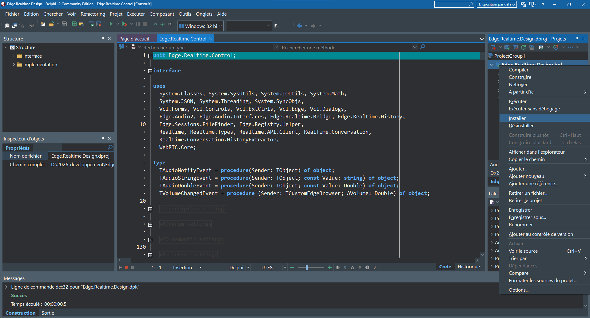
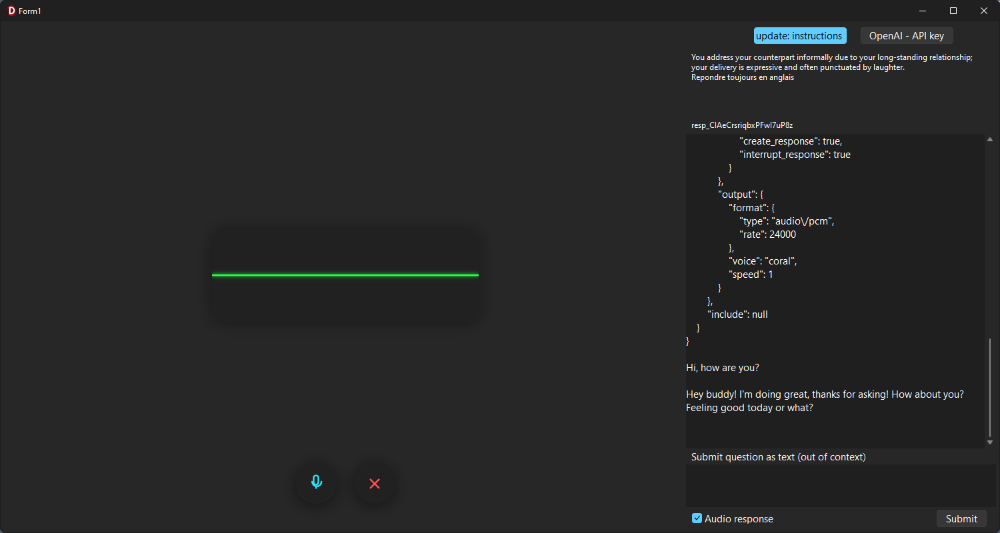
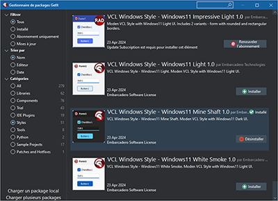

# Edge-OpenAI-Realtime (POC VCL + WebView2)
 

 

___

A **VCL** component that encapsulates a **UI-free Realtime** layer and an **Edge/WebView2** (Chromium) adapter to drive **WebRTC** (audio + DataChannel) inside an embedded page, enabling **real-time voice interactions** with OpenAI’s Realtime API. The POC validates the end-to-end chain **inside Edge/WebView2** with conversational perceived latency, without reusing documentation sample code, and keeps the Edge adapter **swappable**.

 

>[!WARNING]
> **TL;DR - Executive Summary**
>- **What it is**: a palette-ready VCL component; a UI-free Realtime layer; and an Edge/WebView2 adapter that hosts WebRTC and bridges Delphi ⇄ JS.
>- **What it proves**: live voice to voice; default **semantic_vad**; user **barge-in**; audio playback handled by Edge; rich events to observe session state.
>- **What it does *not* try to do**: native WebRTC stack outside Edge, production packaging, custom audio processing (AEC/AGC), or cloud storage.  
>  _Note: **FMX is not targeted** because Embarcadero does not provide an Edge/WebView2 component for FMX; this is a platform constraint, not a POC choice._

 

> **Built with Delphi 12 Community Edition** (v12.1 Patch 1)  
>The wrapper itself is MIT-licensed.  
>You can compile and test it free of charge with Delphi CE; any recent commercial Delphi edition works as well.

 

---

## Objective
Edge-OpenAI-Realtime ships a **VCL component** that embeds a **UI-free Realtime** layer (Delphi) and an **Edge/WebView2** adapter to orchestrate **WebRTC** (SDP/ICE, DataChannel, mic capture and playback) in the embedded page. The POC demonstrates **real-time voice dialog** with the Realtime API: mic permission, connection establishment, **turn detection** enabled by default (**semantic_vad**), smooth **barge-in**, TTS synthesis and **audio playback**.

Authentication uses **ephemeral client secrets**: no long-lived key in the page. The component exposes a **clean event model** (WebRTC state, listen start/stop, volume, open, etc.) and relies on **JSON interop** (polymorphic payloads, normalization/hydration, safe memory handling). The goal is **to prove the end-to-end real-time chain** in Edge/WebView2 and keep the Edge adapter replaceable, not to build a polished UI.

 

___

## POC Scope 
This POC is **strictly** VCL + Edge/WebView2. **FMX is not targeted** because Embarcadero does not provide an Edge/WebView2 component for FMX. It **does not** include a native WebRTC stack outside Edge, **does not** cover productization (packaging/installer/signing), **does not** implement specialized audio processing (custom AEC/AGC), and **does not** address cloud storage or a production backend.

**Single priority:** validate WebRTC behavior in Edge/WebView2 and Realtime orchestration (latency feel, turn detection, barge-in, ICE lifecycle);  **not** ship a finished product.

 

___

## Guides

The README only provides a **concise overview** of the project.  
For detailed design notes and technical explanations, see the following guides:

- [Architecture](./guides/architecture.md)  
  Explains the three-layer split (**Realtime**, **Edge/WebView2**, **VCL**) and their orchestration.

- [End-to-End Sequence](./guides/end-to-end-Sequence.md)  
  Step-by-step flow from initialization to WebRTC negotiation and DataChannel usage.

- [Deployment Diagram](./guides/deployment-diagram.md)  
  Shows the runtime footprint (EXE, WebView2Loader.dll, local web resources) and external calls.

- [Authentication](./guides/authentication.md)  
  Describes how long-lived keys are resolved in Delphi and exchanged for short-lived **ephemeral secrets**.

- [Reconnect & AutoResume](./guides/reconnect-autoResume.md)  
  Covers the lifecycle during disconnection, controlled shutdown, reconnection, and optional session resume.

- [Component Surface](./guides/component-surface.md)  
  Details the public API of the VCL component (properties, methods, events).

- [Realtime Sources](./guides/realtime-sources.md)  
  Self-contained implementation of the latest OpenAI Realtime API (Sept. 2025), with support for **functions** and **remote MCP tools**.

Each guide is self-contained and can be read independently.  
Together, they provide the **full technical picture** behind the POC.

 

___

## Component installation (POC)
1. **Prereqs**
   - Windows 10+ with **WebView2 Runtime**.
   - Recent Delphi VCL (Win32/Win64).
2. **Setup**
   - Install the component package `Edge.Realtime.Design.dpk` 

  

 

___

## Acceptance Criteria
- Smooth voice↔voice dialog with **conversational perceived latency**.
- **Turn detection** enabled by default, switchable, and **disablable** with manual control.
- **Barge-in** works during playback.
- **ICE lifecycle** works in normal connect/reconnect; diagnostics are actionable.
- **No long-lived secret** ever injected into the page.

 

___

## Caller Example 
The component ships with a demo app that contains the **reference caller**. To avoid drift, this README **does not copy** the code; refer to:

- `sample/EdgeAudioWebRC.zip` (project `EdgeAudioWebRC.dproj`).

**Running the demo**
1. Unzip the archive
2. Open `EdgeAudioWebRC.dproj` in Delphi.
3. Ensure **WebView2 Runtime** is installed.
4. Build & run (F9).

  

>[!NOTE]
> he code examples use the `Windows 11 MineShaft` custom VCL theme.

  

 

### Redistribution 
 - Place the web folder next to the executable; an automatic message appears if it’s missing.
 - Ship WebView2Loader.dll (32/64‑bit) with the executable.  

 

___

## License
This project is licensed under the [MIT](https://choosealicense.com/licenses/mit/) License.

___

 

## Final Note

This repository is a **proof of concept** published for documentation and reference.  
Future updates are not guaranteed, but the project remains available as a basis or inspiration for anyone exploring **Delphi VCL + WebView2 + OpenAI Realtime**.
