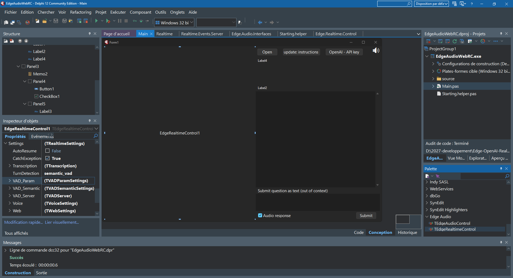

# Component Surface (API)
## Properties (excerpt)
- `TurnDetection`: `semantic_vad` (default) | `server_vad` | `null` (manual control).
- `VadSemantic`: pass-through knobs for eagerness/interrupt behavior **as supported by the Realtime API**.
- `VadServer`: pass-through knobs (`threshold`, `silence_ms`, `prefix_padding_ms`, `idle_timeout_ms`) **when/if exposed by the API**.
- `PersistOptions`: simple persistence for developer profiles.

> [!NOTE]
> VAD behavior is controlled by the Realtime API. The component **does not implement local VAD**; it only configures/forwards supported settings or allows **manual control** when `TurnDetection = null`.

## Methods (excerpt)
- `Connect`, `Disconnect`, session/PeerConnection lifecycle.
- `Commit`, end the user turn when `TurnDetection = null`.
- `ResponseCreate`, explicit response request (aligned with Realtime).

## Events (excerpt)
- `OnRTOpen`, `OnRTPcState`, `OnRTDataChannel`, `OnRTListen`, `OnRTVolumeChanged`, `OnRTMicClick`, `OnRTError`.

 

## View the component’s properties in the Object Inspector.

  

